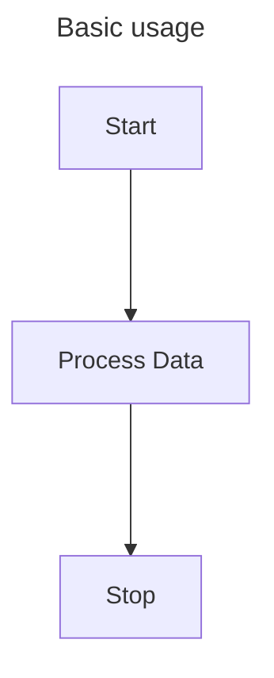
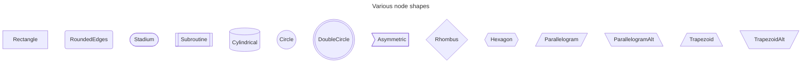
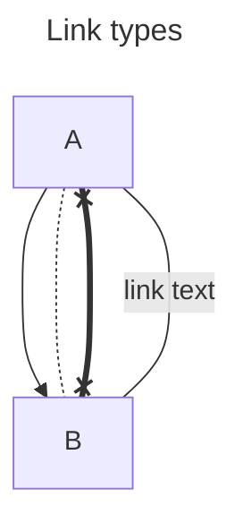
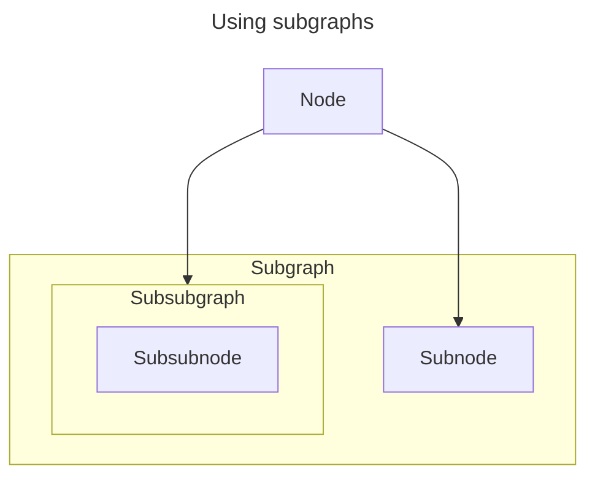
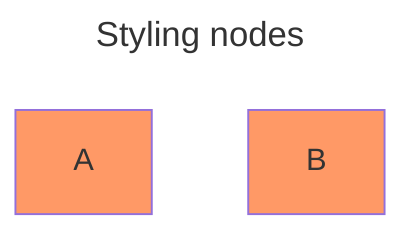
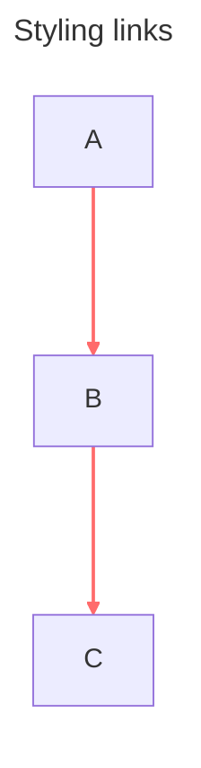

# Mermaid.NET.Flowcharts

A lightweight .NET library for generating Mermaid flowchart markup. `Mermaid.NET.Flowcharts` focuses on the core features of Mermaid flowcharts without unnecessary complexity.

## Features

- Support for all standard Mermaid node shapes
- Customizable link types and directions
- Subgraph support
- Unicode text support
- Node styling
- Link styling

### To be added

- [Mermaid Configuration Schema](https://mermaid.js.org/config/schema-docs/config.html) (partial)

## Basic Usage

`Mermaid.NET.Flowcharts` allows you to quickly define nodes and links between nodes so that you can add them to a flowchart. The `ToMermaidString()` method handles the formatting of the output automatically, allowing you to copy and paste the output inside a Mermaid block to render it in Markdown.

```cs
using Mermaid.Flowcharts;
using Mermaid.Flowcharts.Nodes;
using Mermaid.Flowcharts.Links;

// Create a new flowchart
FlowchartTitle flowchartTitle = FlowchartTitle.FromString("Basic usage");
Flowchart flowchart = new(flowchartTitle);

// Create nodes
Node start = Node.Create("start", "Start");
Node process = Node.Create("process", "Process Data");
Node stop = Node.Create("stop", "Stop");

// Create links
Link startToProcess = new(start, process, default);
Link processToEnd = new(process, stop, default);

// Add nodes and links to the flowchart
flowchart
    .AddNode(start)
    .AddNode(process)
    .AddNode(stop)
    .AddLink(startToProcess)
    .AddLink(processToEnd);

// Generate the Mermaid output
string mermaid = flowchart.ToMermaidString();
```

Will generate the following Mermaid output:



## Advanced features

### Node shapes

Use the `Node.Create` factory method with a custom `NodeShape` to generate nodes with different shapes. Nodes are rectangular by default.

```cs
using Mermaid.Flowcharts;
using Mermaid.Flowcharts.Nodes;

// Create a new flowchart
FlowchartTitle flowchartTitle = FlowchartTitle.FromString("Various node shapes");
Flowchart flowchart = new(flowchartTitle);

// Create nodes with various shapes
Node rectangle = Node.Create("rectangle", "Rectangle", NodeShape.Rectangle);
Node rounded = Node.Create("rounded", "RoundedEdges", NodeShape.RoundedEdges);
Node stadium = Node.Create("stadium", "Stadium", NodeShape.Stadium);
Node subroutine = Node.Create("subroutine", "Subroutine", NodeShape.Subroutine);
Node cylindrical = Node.Create("cylindrical", "Cylindrical", NodeShape.Cylindrical);
Node circle = Node.Create("circle", "Circle", NodeShape.Circle);
Node doubleCircle = Node.Create("doubleCircle", "DoubleCircle", NodeShape.DoubleCircle);
Node asymmetric = Node.Create("asymmetric", "Asymmetric", NodeShape.Asymmetric);
Node rhombus = Node.Create("rhombus", "Rhombus", NodeShape.Rhombus);
Node hexagon = Node.Create("hexagon", "Hexagon", NodeShape.Hexagon);
Node parallelogram = Node.Create("parallelogram", "Parallelogram", NodeShape.Parallelogram);
Node parallelogramAlt = Node.Create("parallelogramAlt", "ParallelogramAlt", NodeShape.ParallelogramAlt);
Node trapezoid = Node.Create("trapezoid", "Trapezoid", NodeShape.Trapezoid);
Node trapezoidAlt = Node.Create("trapezoidAlt", "TrapezoidAlt", NodeShape.TrapezoidAlt);

// Add the nodes to the flowchart
flowchart
    .AddNode(rectangle)
    .AddNode(rounded)
    .AddNode(stadium)
    .AddNode(subroutine)
    .AddNode(cylindrical)
    .AddNode(circle)
    .AddNode(doubleCircle)
    .AddNode(asymmetric)
    .AddNode(rhombus)
    .AddNode(hexagon)
    .AddNode(parallelogram)
    .AddNode(parallelogramAlt)
    .AddNode(trapezoid)
    .AddNode(trapezoidAlt);

// Generate the Mermaid output
string mermaid = flowchart.ToMermaidString();
```

Will generate the following Mermaid output:



### Link types

When creating a link between nodes, you can specify a `LinkType`.
The link type lets you define the *thickness*, the *direction* and the *arrow type* of a link.

```cs
using Mermaid.Flowcharts;
using Mermaid.Flowcharts.Nodes;
using Mermaid.Flowcharts.Links;

// Create a new flowchart
FlowchartTitle flowchartTitle = FlowchartTitle.FromString("Link types");
Flowchart flowchart = new(flowchartTitle);

// Create two nodes
Node a = Node.Create("a", "A");
Node b = Node.Create("b", "B");

// Create links with specific types and text
LinkType arrowLeftToRightNormal = LinkType.Create(LinkArrowType.Arrow, LinkDirection.FromTo, LinkThickness.Normal);
Link arrowLeftToRightNormalLink = Link.Create(a, b, arrowLeftToRightNormal);
LinkType circleRightToLeftDotted = LinkType.Create(LinkArrowType.Circle, LinkDirection.ToFrom, LinkThickness.Dotted);
Link circleRightToLeftDottedLink = Link.Create(a, b, circleRightToLeftDotted);
LinkType crossBothThick = LinkType.Create(LinkArrowType.Cross, LinkDirection.Both, LinkThickness.Thick);
Link crossBothThickLink = Link.Create(a, b, crossBothThick);
LinkType noneNormal = LinkType.Create(LinkArrowType.None, LinkDirection.Both, LinkThickness.Normal);
Link noneNormalTextLink = Link.Create(a, b, noneNormal, "link text");

// Add nodes and links to the flowchart
flowchart
    .AddNode(a)
    .AddNode(b)
    .AddLink(arrowLeftToRightNormalLink)
    .AddLink(circleRightToLeftDottedLink)
    .AddLink(crossBothThickLink)
    .AddLink(noneNormalTextLink);

// Generate the Mermaid output
string mermaid = flowchart.ToMermaidString();
```

Will generate the following Mermaid output:



### Subgraphs

It is also possible to create subgraphs, which are a type of node that can themselves contain nodes.
Subgraphs can be nested within subgraphs, and links can exist between them.
However, all links are managed on the flowchart level, not on the subgraph level.

```cs
using Mermaid.Flowcharts;
using Mermaid.Flowcharts.Nodes;
using Mermaid.Flowcharts.Links;

// Create a new flowchart with a node
FlowchartTitle flowchartTitle = FlowchartTitle.FromString("Using subgraphs");
Flowchart flowchart = new(flowchartTitle);
Node node = Node.Create("n", "Node");
flowchart.AddNode(node);

// Create a subgraph with one node
Subgraph subgraph = Subgraph.Create<MermaidUnicodeText>("sg", "Subgraph");
Node subnode = Node.Create("sn", "Subnode");
subgraph.AddNode(subnode);

// Create a subsubgraph with a node inside subgraph
Subgraph subsubgraph = Subgraph.Create<MermaidUnicodeText>("ssg", "Subsubgraph");
Node subsubnode = Node.Create("ssn", "Subsubnode");
subsubgraph.AddNode(subsubnode);

// Add the subsubgraph to the subgraph
subgraph.AddNode(subsubgraph);

// Add the subgraph to the flowchart
flowchart.AddNode(subgraph);

// Create a link between the flowchart node and the subsubgraph
Link nodeToSubSubGraph = Link.Create(node, subsubgraph, default);
flowchart.AddLink(nodeToSubSubGraph);

// Create a link between the flowchart node and the subnode
Link nodeToSubnode = Link.Create(node, subnode, default);
flowchart.AddLink(nodeToSubnode);

// Generate the Mermaid output
string mermaid = flowchart.ToMermaidString();
```

Will generate the following Mermaid output:



### Styling

In Mermaid, both nodes and links can be styled using a style class.
The corresponding type in `Mermaid.NET.Flowcharts` is called `StyleClass`.
This type wraps some common style attributes, such as:
- fill color
- stroke color
- stroke width
- font size
- etc.

#### Styling nodes

In Mermaid, nodes can be through a style class definitions, which show up as `classDef` inside the flowchart.
To do this, you must create a `NodeStyle` with a given name and a `StyleClass` and use that node style when creating a node.
If you create multiple nodes using the same node style, they will be grouped together automatically when applying the style class.

```cs
using Mermaid.Flowcharts;
using Mermaid.Flowcharts.Nodes;

// Create a new flowchart
FlowchartTitle flowchartTitle = FlowchartTitle.FromString("Styling nodes");
Flowchart flowchart = new(flowchartTitle);

// Define a style class
StyleClass nodeStyleClass = new(Fill: new Fill(Color.FromHex("#ff9966")));

// Create a named node style
NodeStyle nodeStyle = new("customStyle", nodeStyleClass);

// Create two nodes with the node style
Node a = Node.Create("a", "A", nodeStyle: nodeStyle);
Node b = Node.Create("b", "B", nodeStyle: nodeStyle);

// Add the nodes to the flowchart
flowchart
    .AddNode(a)
    .AddNode(b);

// Generate the Mermaid output
string mermaid = flowchart.ToMermaidString();
```

Will generate the following Mermaid output:



#### Styling links

Styling links does not require a separate class, you directly apply a `StyleClass` to them.
Due to the fact that links don't have IDs, they are grouped together by index (counter in order of appearance).

```cs
using Mermaid.Flowcharts;
using Mermaid.Flowcharts.Nodes;
using Mermaid.Flowcharts.Links;

// Create a new flowchart
FlowchartTitle flowchartTitle = FlowchartTitle.FromString("Styling links");
Flowchart flowchart = new(flowchartTitle);

// Define some nodes
Node a = Node.Create("a", "A");
Node b = Node.Create("b", "B");
Node c = Node.Create("c", "C");

// Define a style class
StyleClass linkStyleClass = new(
    Stroke: new Stroke(Color.FromHex("#ff6b6b")),
    StrokeWidth: StrokeWidth.Length(2, Unit.Px));

// Create some links
Link ab = Link.Create(a, b, linkStyle: linkeStyleClass);
Link bc = Link.Create(b, c, linkStyle: linkeStyleClass);

// Add the nodes and links to the flowchart
flowchart
    .AddNode(a)
    .AddNode(b)
    .AddNode(c)
    .AddLink(ab)
    .AddLink(bc);

// Generate the Mermaid output
string mermaid = flowchart.ToMermaidString();
```

Will generate the following Mermaid output:



You can define multiple node styles and link styles in a single flowchart.
