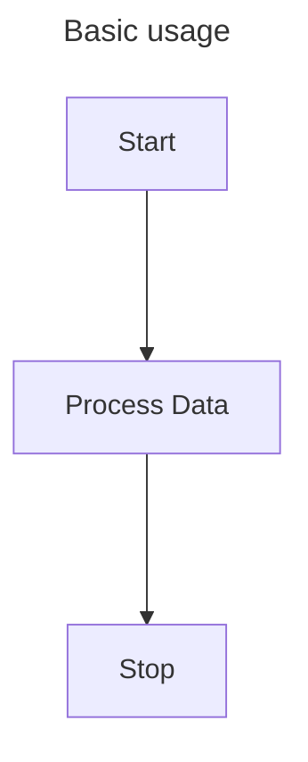
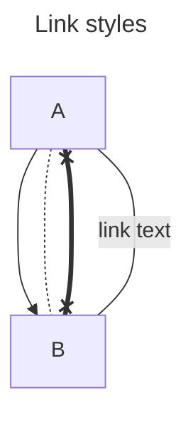
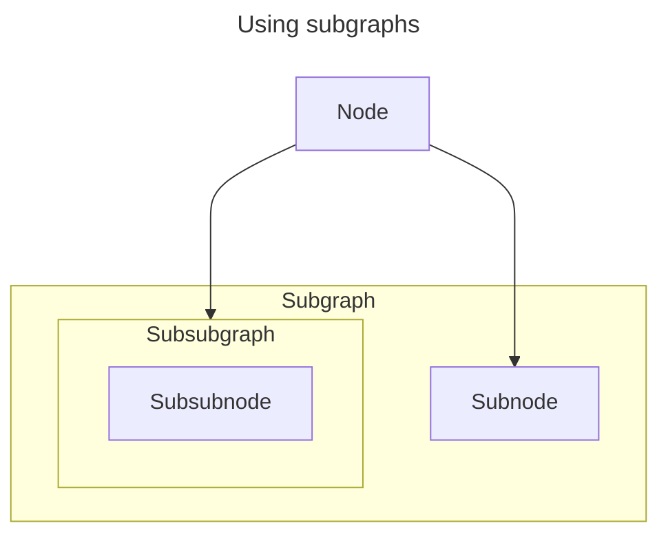

# Mermaid.NET.Flowcharts

A lightweight .NET library for generating Mermaid flowchart markup. This library focuses on the core features of Mermaid flowcharts without unnecessary complexity.

## Features

- Support for all standard Mermaid node shapes
- Customizable link styles and directions
- Subgraph support
- Unicode text support

## Basic Usage

`Mermaid.NET.Flowcharts` allows you to quickly define nodes and links between nodes so that you can add them to a flowchart. The `ToMermaidString()` method handles the formatting of the output automatically, allowing you to copy and paste the output inside a Mermaid block to render it in Markdown.

```cs
using Mermaid.Flowcharts;
using Mermaid.Flowcharts.Nodes;
using Mermaid.Flowcharts.Links;

// Create a new flowchart
FlowchartTitle flowchartTitle = FlowchartTitle.FromString("Basic usage");
Flowchart flowchart = new(flowchartTitle);

// Create nodes
Node start = Node.Create("start", "Start");
Node process = Node.Create("process", "Process Data");
Node stop = Node.Create("stop", "Stop");

// Create links
Link startToProcess = new(start, process, default);
Link processToEnd = new(process, stop, default);

// Add nodes and links to the flowchart
flowchart
    .AddNode(start)
    .AddNode(process)
    .AddNode(stop)
    .AddLink(startToProcess)
    .AddLink(processToEnd);

// Generate the Mermaid output
string mermaid = flowchart.ToMermaidString();
```

Will generate the following Mermaid output:



## Advanced features

### Node shapes

Use the `Node.Create` factory method with a custom `NodeShape` to generate nodes with different shapes. Nodes are rectangular by default.

```cs
using Mermaid.Flowcharts;
using Mermaid.Flowcharts.Nodes;

// Create a new flowchart
FlowchartTitle flowchartTitle = FlowchartTitle.FromString("Various node shapes");
Flowchart flowchart = new(flowchartTitle);

// Create nodes with various shapes
Node rectangle = Node.Create("rectangle", "Rectangle", NodeShape.Rectangle);
Node rounded = Node.Create("rounded", "RoundedEdges", NodeShape.RoundedEdges);
Node stadium = Node.Create("stadium", "Stadium", NodeShape.Stadium);
Node subroutine = Node.Create("subroutine", "Subroutine", NodeShape.Subroutine);
Node cylindrical = Node.Create("cylindrical", "Cylindrical", NodeShape.Cylindrical);
Node circle = Node.Create("circle", "Circle", NodeShape.Circle);
Node doubleCircle = Node.Create("doubleCircle", "DoubleCircle", NodeShape.DoubleCircle);
Node asymmetric = Node.Create("asymmetric", "Asymmetric", NodeShape.Asymmetric);
Node rhombus = Node.Create("rhombus", "Rhombus", NodeShape.Rhombus);
Node hexagon = Node.Create("hexagon", "Hexagon", NodeShape.Hexagon);
Node parallelogram = Node.Create("parallelogram", "Parallelogram", NodeShape.Parallelogram);
Node parallelogramAlt = Node.Create("parallelogramAlt", "ParallelogramAlt", NodeShape.ParallelogramAlt);
Node trapezoid = Node.Create("trapezoid", "Trapezoid", NodeShape.Trapezoid);
Node trapezoidAlt = Node.Create("trapezoidAlt", "TrapezoidAlt", NodeShape.TrapezoidAlt);

// Add the nodes to the flowchart
flowchart
    .AddNode(rectangle)
    .AddNode(rounded)
    .AddNode(stadium)
    .AddNode(subroutine)
    .AddNode(cylindrical)
    .AddNode(circle)
    .AddNode(doubleCircle)
    .AddNode(asymmetric)
    .AddNode(rhombus)
    .AddNode(hexagon)
    .AddNode(parallelogram)
    .AddNode(parallelogramAlt)
    .AddNode(trapezoid)
    .AddNode(trapezoidAlt);

// Generate the Mermaid output
string mermaid = flowchart.ToMermaidString();
```

Will generate the following Mermaid output:


### Link styles

When creating a link between nodes, you can specify a `LinkStyle`.
The link style lets you define the *thickness*, the *direction* and the *arrow type* of a link.

```cs
using Mermaid.Flowcharts;
using Mermaid.Flowcharts.Nodes;
using Mermaid.Flowcharts.Links;

// Create a new flowchart
FlowchartTitle flowchartTitle = FlowchartTitle.FromString("Link styles");
Flowchart flowchart = new(flowchartTitle);

// Create two nodes
Node a = Node.Create("a", "A");
Node b = Node.Create("b", "B");

// Create links with specific styles and text
LinkStyle arrowLeftToRightNormal = new(LinkArrowType.Arrow, LinkDirection.LeftToRight, LinkThickness.Normal);
Link arrowLeftToRightNormalLink = new(a, b, arrowLeftToRightNormal);
LinkStyle circleRightToLeftDotted = new(LinkArrowType.Circle, LinkDirection.RightToLeft, LinkThickness.Dotted);
Link circleRightToLeftDottedLink = new(a, b, circleRightToLeftDotted);
LinkStyle crossBothThick = new(LinkArrowType.Cross, LinkDirection.Both, LinkThickness.Thick);
Link crossBothThickLink = new(a, b, crossBothThick);
LinkStyle noneNormal = new(LinkArrowType.None, LinkDirection.Both, LinkThickness.Normal);
LinkText text = LinkText.FromString("link text");
Link noneNormalTextLink = new(a, b, noneNormal, text);

// Add nodes and links to the flowchart
flowchart
    .AddNode(a)
    .AddNode(b)
    .AddLink(arrowLeftToRightNormalLink)
    .AddLink(circleRightToLeftDottedLink)
    .AddLink(crossBothThickLink)
    .AddLink(noneNormalTextLink);

// Generate the Mermaid output
string mermaid = flowchart.ToMermaidString();
```

Will generate the following Mermaid output:



### Subgraphs

It is also possible to create subgraphs, which are a type of node that can themselves contain nodes.
Subgraphs can be nested within subgraphs, and links can exist between them.
However, all links are managed on the flowchart level, not on the subgraph level.

```cs
using Mermaid.Flowcharts;
using Mermaid.Flowcharts.Nodes;
using Mermaid.Flowcharts.Links;

// Create a new flowchart with a node
FlowchartTitle flowchartTitle = FlowchartTitle.FromString("Using subgraphs");
Flowchart flowchart = new(flowchartTitle);
Node node = Node.Create("n", "Node");
flowchart.AddNode(node);

// Create a subgraph with one node
NodeIdentifier subgraphId = NodeIdentifier.FromString("sg");
MermaidUnicodeText subgraphLabel = MermaidUnicodeText.FromString("Subgraph");
Subgraph subgraph = new(subgraphId, subgraphLabel);
Node subnode = Node.Create("sn", "Subnode");
subgraph.AddNode(subnode);

// Create a subsubgraph with a node inside subgraph
NodeIdentifier subsubgraphId = NodeIdentifier.FromString("ssg");
MermaidUnicodeText subsubgraphLabel = MermaidUnicodeText.FromString("Subsubgraph");
Subgraph subsubgraph = new(subsubgraphId, subsubgraphLabel);
Node subsubnode = Node.Create("ssn", "Subsubnode");
subsubgraph.AddNode(subsubnode);

// Add the subsubgraph to the subgraph
subgraph.AddNode(subsubgraph);

// Add the subgraph to the flowchart
flowchart.AddNode(subgraph);

// Create a link between the flowchart node and the subsubgraph
Link nodeToSubSubGraph = new(node, subsubgraph, default);
flowchart.AddLink(nodeToSubSubGraph);

// Create a link between the flowchart node and the subnode
Link nodeToSubnode = new(node, subnode, default);
flowchart.AddLink(nodeToSubnode);

// Generate the Mermaid output
string mermaid = flowchart.ToMermaidString();
```

Will generate the following Mermaid output:

