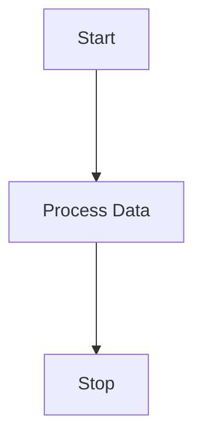
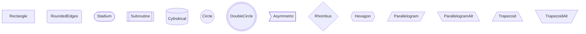

# Mermaid.NET.Flowcharts

A lightweight .NET library for generating Mermaid flowchart markup. This library focuses on the core features of Mermaid flowcharts without unnecessary complexity.

## Features

- Fluent API for building flowcharts
- Support for all standard Mermaid node shapes
- Customizable link styles and directions
- Subgraph support
- Unicode text support

## Basic Usage

`Mermaid.NET.Flowcharts` allows you to quickly define nodes and links between nodes so that you can add them to a flowchart. The `ToMermaidString()` method handles the formatting of the output automatically, allowing you to copy and paste the output inside a Mermaid block to render it in Markdown.

```cs
using Mermaid.Flowcharts;
using Mermaid.Flowcharts.Nodes;
using Mermaid.Flowcharts.Links;

// Create a new flowchart
Flowchart flowchart = new();

// Add nodes
Node start = Node.Create("start", "Start");
Node process = Node.Create("process", "Process Data");
Node stop = Node.Create("stop", "Stop");

// Create links
Link startToProcess = new(start, process, new());
Link processToEnd = new(process, stop, new());

// Add nodes and links to the flowchart
flowchart
    .AddNode(start)
    .AddNode(process)
    .AddNode(stop)
    .AddLink(startToProcess)
    .AddLink(processToEnd);

// Generate the Mermaid string
string mermaid = flowchart.ToMermaidString();
```

Will generate the following Mermaid output:



## Advanced features

### Node shapes

Use the `Node.Create` factory method with a custom `NodeShape` to generate nodes with different shapes. Nodes are rectangular by default.

```cs
using Mermaid.Flowcharts;
using Mermaid.Flowcharts.Nodes;

Flowchart flowchart = new();

Node rectangle = Node.Create("rectangle", "Rectangle", NodeShape.Rectangle);
Node rounded = Node.Create("rounded", "RoundedEdges", NodeShape.RoundedEdges);
Node stadium = Node.Create("stadium", "Stadium", NodeShape.Stadium);
Node subroutine = Node.Create("subroutine", "Subroutine", NodeShape.Subroutine);
Node cylindrical = Node.Create("cylindrical", "Cylindrical", NodeShape.Cylindrical);
Node circle = Node.Create("circle", "Circle", NodeShape.Circle);
Node doubleCircle = Node.Create("doubleCircle", "DoubleCircle", NodeShape.DoubleCircle);
Node asymmetric = Node.Create("asymmetric", "Asymmetric", NodeShape.Asymmetric);
Node rhombus = Node.Create("rhombus", "Rhombus", NodeShape.Rhombus);
Node hexagon = Node.Create("hexagon", "Hexagon", NodeShape.Hexagon);
Node parallelogram = Node.Create("parallelogram", "Parallelogram", NodeShape.Parallelogram);
Node parallelogramAlt = Node.Create("parallelogramAlt", "ParallelogramAlt", NodeShape.ParallelogramAlt);
Node trapezoid = Node.Create("trapezoid", "Trapezoid", NodeShape.Trapezoid);
Node trapezoidAlt = Node.Create("trapezoidAlt", "TrapezoidAlt", NodeShape.TrapezoidAlt);

flowchart
    .AddNode(rectangle)
    .AddNode(rounded)
    .AddNode(stadium)
    .AddNode(subroutine)
    .AddNode(cylindrical)
    .AddNode(circle)
    .AddNode(doubleCircle)
    .AddNode(asymmetric)
    .AddNode(rhombus)
    .AddNode(hexagon)
    .AddNode(parallelogram)
    .AddNode(parallelogramAlt)
    .AddNode(trapezoid)
    .AddNode(trapezoidAlt);

string mermaid = flowchart.ToMermaidString();
```

Will generate the following Mermaid output:


### Link styles

### Subgraphs